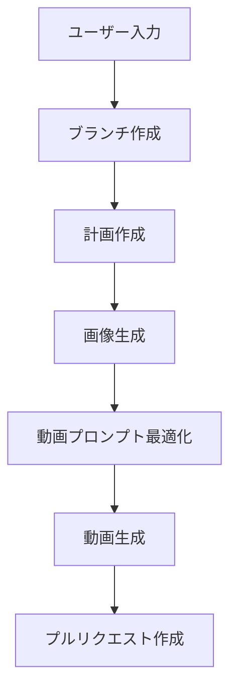

# ワークフロー構造解説

## 概要

このGitHub Actionsワークフローは、AIを使用して自動的に画像と動画を生成し、プルリクエストを作成するシステムです。

## 📊 全体のフロー図



## 🏗️ ワークフローの構造

### 1. トリガー（開始条件）

**手動実行**: `workflow_dispatch`
- GitHub Actionsページから手動で実行
- プロンプト（動画の内容）を入力

**Issue連動**: `issues` + `issue_comment`
- Issue作成時または Issue コメント時に自動実行
- `@create-video-i2v` コマンドで開始

### 2. ジョブ構成（6つの段階）

#### ジョブ1: `setup-branch` 🌿
**目的**: 新しいブランチを作成して作業環境を準備

```yaml
permissions:
  contents: write  # ブランチ作成・ファイル変更権限
```

**実行内容**:
- 日時とrun_idを組み合わせたユニークなブランチ名を生成
- 新しいブランチを作成してプッシュ
- 他のジョブで使用するブランチ名とフォルダ名を出力

**出力**:
- `branch-name`: 新しく作成されたブランチ名
- `folder-name`: 生成ファイル用のフォルダ名

---

#### ジョブ2: `planning` 📋
**目的**: ユーザーの指示を分析し、最適な画像・動画生成計画を立案

```yaml
needs: [setup-branch]  # setup-branchの完了を待つ
permissions:
  contents: write
```

**使用ツール**:
- Claude Code SDK
- `Read`, `Write`, `Edit` ツール

**実行内容**:
1. ユーザープロンプトを分析
2. 画像生成用の詳細なプロンプトを作成
3. 動画生成用のコンセプトを定義
4. 計画書ファイルを生成
   - `video-plan.md`: 全体計画書
   - `image-prompt.txt`: 機械処理用画像プロンプト
   - `image-prompt.md`: ユーザー確認用画像プロンプト
   - `video-concept.txt`: 機械処理用動画コンセプト
   - `video-concept.md`: ユーザー確認用動画コンセプト

**出力**:
- `image-prompt`: 次のジョブで使用する画像生成プロンプト
- `video-concept`: 動画生成の基本コンセプト

---

#### ジョブ3: `image-generation` 🎨
**目的**: Imagen4 Ultraを使用して高品質な画像を生成

```yaml
needs: [setup-branch, planning]
permissions:
  contents: write
```

**使用ツール**:
- Claude Code SDK + kamuicode MCP
- Imagen4 Ultra MCP ツール:
  - `mcp__t2i-fal-imagen4-ultra__imagen4_ultra_submit`
  - `mcp__t2i-fal-imagen4-ultra__imagen4_ultra_status`
  - `mcp__t2i-fal-imagen4-ultra__imagen4_ultra_result`
- `Bash` (ダウンロード用)

**実行内容**:
1. 計画ジョブで作成された最適化プロンプトを使用
2. Imagen4 Ultraで画像生成開始
3. 生成ステータスを確認
4. Google認証済URLを取得
5. **重要**: Google URLを `google-image-url.txt` に保存（次のジョブ用）
6. 同じURLから画像をローカルにダウンロード保存

**出力**:
- `google-image-url`: 動画生成で使用するGoogle認証済URL

---

#### ジョブ4: `video-prompt-optimization` 🔍
**目的**: 生成された画像を分析し、動画生成プロンプトを最適化

```yaml
needs: [setup-branch, planning, image-generation]
permissions:
  contents: write
```

**使用ツール**:
- Claude Code SDK
- `Read`, `Write`, `Edit` ツール

**実行内容**:
1. 生成された画像ファイルを読み込み・分析
2. 画像の視覚的要素（色彩、構図、オブジェクト）を把握
3. 初期動画コンセプトと画像内容を照合
4. Vidu Q1に最適化された動画プロンプトを作成
5. 最適化ファイルを生成
   - `optimized-video-prompt.txt`: 機械処理用
   - `optimized-video-prompt.md`: ユーザー確認用
   - `image-analysis.md`: 画像分析レポート

**出力**:
- `optimized-video-prompt`: 画像に基づいて最適化された動画プロンプト

---

#### ジョブ5: `video-generation` 🎬
**目的**: Vidu Q1を使用して画像から動画を生成

```yaml
needs: [setup-branch, image-generation, video-prompt-optimization]
permissions:
  contents: write
```

**使用ツール**:
- Claude Code SDK + kamuicode MCP
- Vidu Q1 MCP ツール:
  - `mcp__r2v-fal-vidu-q1__vidu_q1_submit`
  - `mcp__r2v-fal-vidu-q1__vidu_q1_status`
  - `mcp__r2v-fal-vidu-q1__vidu_q1_result`
- `Bash` (ダウンロード用)

**実行内容**:
1. 前のジョブで保存されたGoogle画像URLを使用
2. 最適化された動画プロンプトでVidu Q1動画生成開始
3. 定期的にステータスを確認（`sleep 60`で待機）
4. 動画URL取得後、ローカルに `generated-video.mp4` として保存
5. ファイルサイズを確認（0バイトでないことを確認）

**重要なポイント**:
- Google URLの有効期限は約1時間
- 動画生成には数分かかるため、忍耐強くステータス確認
- 必ずローカルファイルに保存（保存しないとワークフロー失敗）

---

#### ジョブ6: `create-pr` 📎
**目的**: 全ての成果物をまとめてプルリクエストを作成

```yaml
needs: [setup-branch, planning, image-generation, video-prompt-optimization, video-generation]
permissions:
  contents: write
  pull-requests: write
  actions: read
```

**実行内容**:
1. 全成果物の存在確認とファイル数カウント
2. 生成ファイルをコミット
3. GitHub Actions Summaryに結果表示
4. プルリクエスト作成
   - 画像をMarkdownで埋め込み表示
   - 動画をHTML5 videoタグで埋め込み
   - 詳細な生成情報を記載

## 🔧 技術的なポイント

### 並行実行とは？
```yaml
needs: [job1, job2]  # job1とjob2の両方が完了してから実行
```

### 権限の意味
```yaml
permissions:
  contents: write        # ファイル作成・変更・コミット
  pull-requests: write   # プルリクエスト作成
  actions: read         # 他のワークフロー情報読み取り
```

### 出力の受け渡し
```yaml
# ジョブAで出力
echo "my-value=hello" >> $GITHUB_OUTPUT

# ジョブBで使用
${{ needs.jobA.outputs.my-value }}  # "hello"が取得される
```

### MCP設定の重要性
```yaml
--mcp-config="$MCP_CONFIG_ABS_PATH"           # MCP設定ファイル指定
--allowedTools "mcp__*,Bash"                 # 使用許可するツール
--permission-mode "acceptEdits"              # 編集を自動承認
```

## 🚨 よくあるエラーと対策

### 1. MCP設定エラー
**エラー**: `MCP config file not found`
**対策**: `.claude/mcp-kamuicode.json` が存在することを確認

### 2. 権限エラー
**エラー**: `Permission denied to create branch`
**対策**: リポジトリ設定で "Read and write permissions" を選択

### 3. Google URL期限切れ
**エラー**: 動画生成時に画像URLにアクセスできない
**対策**: 各ジョブで即座にファイル保存、Google URLの有効期限は1時間

### 4. 動画ファイル保存失敗
**エラー**: `No videos were generated`
**対策**: 
- 動画URLを必ずローカルファイルに保存
- ファイルサイズが0バイト以上であることを確認
- `wget`や`curl`コマンドの実行結果を確認

## 💡 カスタマイズのヒント

### 異なるAIモデルを使用する場合
1. MCP設定ファイルに新しいモデルを追加
2. ワークフローファイルの `allowedTools` を更新
3. `.claude/settings.json` の permissions に権限を追加

### 生成パラメータを調整する場合
プロンプト内の以下の部分を編集：
```yaml
PROMPT="画像生成の詳細指示..."
```

### 追加のファイル処理を行う場合
新しいジョブを作成し、`needs:` で依存関係を設定