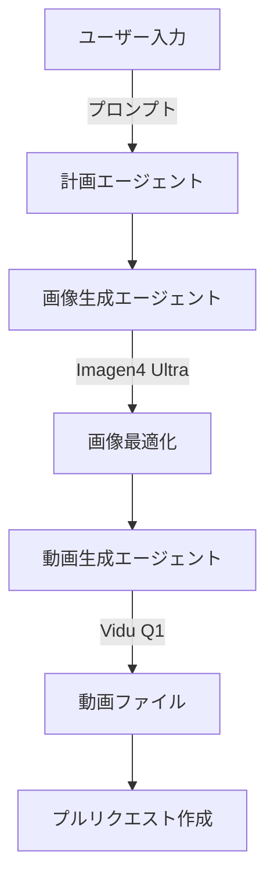

# Video Generation Workflow Documentation

このワークフローは、テキストプロンプトから自動的にAI動画を生成します。

## アーキテクチャ



## ワークフロー種別

### 1. 手動実行ワークフロー (`create-video-from-prompt.yml`)
- GitHub Actionsから手動でトリガー
- workflow_dispatchイベントを使用
- プロンプトを直接入力

### 2. Issue連動ワークフロー (`issue-video-trigger.yml`)
- Issueやコメントから自動トリガー
- `@create-video-i2v` コマンドで起動
- コラボレーション向け

## ジョブ構成

1. **setup-branch**: 作業ブランチの作成
2. **planning**: 動画制作計画の立案
3. **image-generation**: Imagen4 Ultraで画像生成
4. **video-prompt-optimization**: 画像解析と動画プロンプト最適化
5. **video-generation**: Vidu Q1で動画生成
6. **create-pr**: プルリクエスト作成

## トリガー方法

### Issue経由のトリガー
```markdown
@create-video-i2v
コンセプト：未来都市の夕暮れ、ネオンサインが輝き始める瞬間
```

## 必要な環境

- Claude Code SDK
- kamuicode MCP設定
- GitHub Actions環境
- 適切なAPIキー設定

## セットアップ手順

1. ワークフローファイルを `.github/workflows/` に配置
   - `create-video-from-prompt.yml`
   - `issue-video-trigger.yml`
2. Issueテンプレートを `.github/ISSUE_TEMPLATE/` に配置（オプション）
   - `video-request.md`
3. 必要なSecretsを設定
   - `ANTHROPIC_API_KEY`
   - `PAT_TOKEN` (オプション)
4. MCP設定ファイルを準備
5. 手動実行またはIssue経由でトリガー

## 処理フロー

1. **ユーザー指示の受付**
   - 手動入力またはIssueコメント
2. **AIエージェントによる処理**
   - 計画立案
   - 画像生成
   - 動画プロンプト最適化
   - 動画生成
3. **成果物の保存**
   - プルリクエスト作成
   - 画像・動画ファイルの保存

## 権限要件

このワークフローは以下の操作を行うため、適切な権限設定が必要です：

1. **新しいブランチの作成** - 各動画生成ごとに専用ブランチを作成
2. **ファイルのコミット・プッシュ** - 生成した画像・動画をリポジトリに保存
3. **プルリクエストの作成** - 最終成果物をPRとして提出

必要な設定:
- Workflow permissions: "Read and write permissions"
- Allow GitHub Actions to create and approve pull requests: 有効化